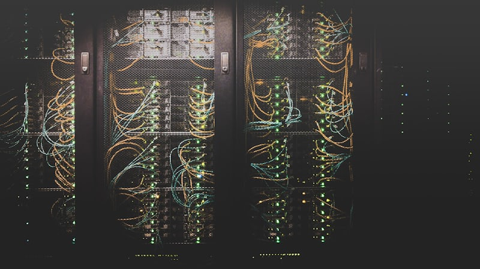

# 🌐 Introduction to the Internet

> *"The Internet is becoming the town square for the global village of tomorrow."* — Bill Gates


---

## 📚 Table of Contents
- [What is the Internet?](#what-is-the-internet)
- [Brief History of the Internet](#brief-history-of-the-internet)
- [The Internet vs The World Wide Web](#the-internet-vs-the-world-wide-web)
- [How Big is the Internet?](#how-big-is-the-internet)
- [Key Concepts You'll Learn](#key-concepts-youll-learn)
- [Why Should You Care?](#why-should-you-care)

---

## 🤔 What is the Internet?

**The Internet is a global network of interconnected computers that communicate with each other using standardized protocols.**

Think of it like this:

```
🏠 Your Home ←→ 🏢 Your ISP ←→ 🌍 Internet Backbone ←→ 🖥️ Servers Worldwide
```

### Simple Analogy: The Postal System 📮

| Postal System | Internet |
|--------------|----------|
| Letter | Data Packet |
| Address on envelope | IP Address |
| Post Office | Router |
| Postal workers sorting mail | Routing protocols |
| Different countries | Different networks |
| Postal routes | Network cables/fiber |

**The Internet is essentially a digital postal system that delivers information in milliseconds instead of days!**

---

## 📜 Brief History of the Internet

### Timeline

```
1969 ─── ARPANET (4 computers connected)
  │
1971 ─── First email sent
  │
1973 ─── TCP/IP protocols invented
  │
1983 ─── ARPANET adopts TCP/IP (Birth of the Internet!)
  │
1989 ─── World Wide Web invented by Tim Berners-Lee
  │
1991 ─── WWW becomes public
  │
1993 ─── First web browser (Mosaic)
  │
1995 ─── Amazon, eBay launch; Internet goes commercial
  │
1998 ─── Google founded
  │
2004 ─── Facebook launches; Social media era begins
  │
2007 ─── iPhone launches; Mobile internet era
  │
2010s ─ Cloud computing, IoT, AI integration
  │
2020s ─ 5G, Edge computing, Web3, AI revolution
```

### 🎬 Watch: History of the Internet

[](https://www.youtube.com/watch?v=9hIQjrMHTv4)

> 🔗 **Video**: [History of the Internet - YouTube](https://www.youtube.com/watch?v=9hIQjrMHTv4)

---

## 🌐 The Internet vs The World Wide Web

Many people use "Internet" and "World Wide Web" interchangeably, but they're different!



| Aspect | The Internet | The World Wide Web (WWW) |
|--------|-------------|-------------------------|
| **What is it?** | Physical infrastructure (cables, routers, servers) | A service that runs ON the Internet |
| **Invented** | 1969 (ARPANET) | 1989 (Tim Berners-Lee) |
| **Contains** | Hardware + Protocols | Websites, web pages, hyperlinks |
| **Example** | The road system | Cars driving on roads |
| **Protocol** | TCP/IP, UDP, etc. | HTTP/HTTPS |

### Think of it this way:

```
🌐 THE INTERNET (Infrastructure Layer)
├── 📧 Email (SMTP, IMAP, POP3)
├── 🌍 World Wide Web (HTTP/HTTPS)
├── 📁 File Transfer (FTP, SFTP)
├── 🎮 Online Gaming
├── 📹 Video Streaming
├── 💬 Instant Messaging
└── 📞 VoIP (Voice over IP)
```

**The Internet is the highway; the Web is just one type of vehicle on it!**

---

## 📊 How Big is the Internet?

### Mind-Blowing Statistics (2024-2025)

| Metric | Value |
|--------|-------|
| 🧑‍💻 Internet Users | ~5.5 billion (68% of world population) |
| 🌐 Websites | ~2 billion |
| 📧 Emails sent per day | ~350 billion |
| 🔍 Google searches per day | ~8.5 billion |
| 📺 YouTube videos watched per day | ~1 billion hours |
| 📱 Connected devices (IoT) | ~15 billion |
| 💾 Data created daily | ~400 million TB |

### Physical Infrastructure

```
┌─────────────────────────────────────────────────────────────┐
│                   UNDERSEA CABLES                           │
│  • Over 550 submarine cables worldwide                      │
│  • 1.4 million km of cable on ocean floor                   │
│  • Carry 99% of intercontinental data                       │
│  • Cable thickness: about the size of a garden hose         │
└─────────────────────────────────────────────────────────────┘
```

### 🗺️ Submarine Cable Map

> 🔗 **Interactive Map**: [Submarine Cable Map](https://www.submarinecablemap.com/)

---

## 🎯 Key Concepts You'll Learn

This course will take you from beginner to advanced understanding of the Internet. Here's what we'll cover:

### Module Overview

| # | Topic | Description |
|---|-------|-------------|
| 00 | **Introduction** | You are here! 📍 |
| 01 | **How the Internet Works** | Data packets, protocols, infrastructure |
| 02 | **IP Addresses** | IPv4, IPv6, public vs private IPs |
| 03 | **DNS** | How domain names become IP addresses |
| 04 | **HTTP/HTTPS** | Web protocols and security |
| 05 | **TCP/IP Model** | The foundation of internet communication |
| 06 | **Routing & Switching** | How data finds its destination |
| 07 | **Web Browsers** | Behind the scenes of browsing |
| 08 | **Network Security** | Firewalls, VPNs, encryption |
| 09 | **Cloud & CDN** | Modern internet infrastructure |

---

## ❓ Why Should You Care?

### For Everyone 👥

- **Privacy**: Understand how your data travels and who can see it
- **Security**: Protect yourself from online threats
- **Troubleshooting**: Fix your own internet problems
- **Digital Literacy**: Be an informed citizen of the digital age

### For Developers 👨‍💻

- **Better Debugging**: Understand network-related issues
- **Performance**: Optimize your applications
- **Architecture**: Design better distributed systems
- **Career Growth**: Networking knowledge is essential

### For Business 💼

- **Infrastructure**: Make informed decisions about tech investments
- **Security**: Protect your company's data
- **Scalability**: Understand cloud and CDN options

---

## 🧪 Quick Knowledge Check

Before we dive deeper, test your current knowledge:

<details>
<summary>❓ What happens when you type "google.com" in your browser?</summary>

**A LOT happens in milliseconds!**

1. Browser checks cache for DNS record
2. DNS lookup converts "google.com" to IP address
3. Browser establishes TCP connection with server
4. Browser sends HTTP/HTTPS request
5. Server processes request and sends response
6. Browser renders the page

*We'll cover this in detail in upcoming modules!*

</details>

<details>
<summary>❓ Is your internet connection really "wireless"?</summary>

**Not entirely!**

Even with WiFi:
- Your router connects to your ISP via cable (fiber/coaxial)
- Data travels through underground/underwater cables
- Only the "last mile" to your device is wireless

*99% of internet data travels through physical cables!*

</details>

<details>
<summary>❓ How fast does data travel on the internet?</summary>

**Nearly the speed of light!**

- Light in fiber optic: ~200,000 km/s (⅔ speed of light)
- Data can travel around the world in ~100-200ms
- Most delay comes from processing at routers, not travel time

</details>

---

## 📖 Glossary

| Term | Definition |
|------|------------|
| **Protocol** | A set of rules for communication between devices |
| **Server** | A computer that provides services to other computers |
| **Client** | A device that requests services from a server |
| **ISP** | Internet Service Provider (Airtel, Jio, Comcast, etc.) |
| **Bandwidth** | Maximum data transfer rate of a network |
| **Latency** | Time delay for data to travel from source to destination |
| **Packet** | A small unit of data transmitted over a network |

---

## 🔗 External Resources

### 📹 Videos
- [How the Internet Works - Code.org](https://www.youtube.com/watch?v=Dxcc6ycZ73M)
- [The Internet: Crash Course Computer Science](https://www.youtube.com/watch?v=AEaKrq3SpW8)
- [How Does the Internet Work? - Lesics](https://www.youtube.com/watch?v=x3c1ih2NJEg)

### 📚 Articles
- [How Does the Internet Work? - Stanford](https://web.stanford.edu/class/msande91si/www-spr04/readings/week1/InternetWhitepaper.htm)
- [Internet Basics - Mozilla Developer Network](https://developer.mozilla.org/en-US/docs/Learn/Common_questions/Web_mechanics/How_does_the_Internet_work)

### 🎮 Interactive
- [Submarine Cable Map](https://www.submarinecablemap.com/)
- [Internet Health Report](https://www.bgp.he.net/)

---

## ⏭️ What's Next?

Now that you understand what the Internet is and why it matters, let's dive into:

**[➡️ 01 - How the Internet Works](./01-how-internet-works.md)**

We'll explore:
- How data packets travel across the world
- The physical infrastructure of the Internet
- Client-server architecture
- And much more!

---

<div align="center">

**🎓 Elite Ball Knowledge - Internet Fundamentals**

[Previous: None] | [Home](./README.md) | [Next: How Internet Works →](./01-how-internet-works.md)

</div>
