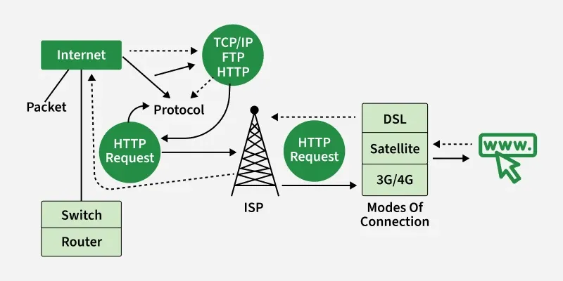

# 🔌 How the Internet Works

> *"The Internet is not just one thing, it's a collection of things - of numerous communications networks that all speak the same language."* — Tim Berners-Lee



---

## 📚 Table of Contents
- [The Big Picture](#the-big-picture)
- [Data Packets: The Building Blocks](#data-packets-the-building-blocks)
- [The Physical Infrastructure](#the-physical-infrastructure)
- [Client-Server Architecture](#client-server-architecture)
- [Peer-to-Peer Networks](#peer-to-peer-networks)
- [How Data Travels](#how-data-travels)
- [The Journey of a Web Request](#the-journey-of-a-web-request)
- [Real-World Analogy](#real-world-analogy)

---

## 🌍 The Big Picture

The Internet is a **network of networks**. Let's visualize its layered structure:

```
┌─────────────────────────────────────────────────────────────────┐
│                        THE INTERNET                              │
│  ┌───────────────────────────────────────────────────────────┐  │
│  │                  INTERNET BACKBONE                         │  │
│  │  (High-speed fiber optic cables connecting continents)     │  │
│  │                                                            │  │
│  │    🌐═══════════════════════════════════════════🌐         │  │
│  │     ║              ║              ║              ║          │  │
│  │     ▼              ▼              ▼              ▼          │  │
│  │  ┌─────┐       ┌─────┐       ┌─────┐       ┌─────┐         │  │
│  │  │ IXP │       │ IXP │       │ IXP │       │ IXP │         │  │
│  │  └──┬──┘       └──┬──┘       └──┬──┘       └──┬──┘         │  │
│  └─────┼─────────────┼─────────────┼─────────────┼────────────┘  │
│        │             │             │             │               │
│   ┌────▼────┐   ┌────▼────┐   ┌────▼────┐   ┌────▼────┐         │
│   │  ISP A  │   │  ISP B  │   │  ISP C  │   │  ISP D  │         │
│   │ (Airtel)│   │ (Jio)   │   │(Comcast)│   │ (AT&T)  │         │
│   └────┬────┘   └────┬────┘   └────┬────┘   └────┬────┘         │
│        │             │             │             │               │
│    ┌───▼───┐     ┌───▼───┐     ┌───▼───┐     ┌───▼───┐          │
│    │🏠🏠🏠│     │🏢🏢🏢│     │🏫🏫🏫│     │🏭🏭🏭│          │
│    │ Homes │     │Offices│     │Schools│     │Factory│          │
│    └───────┘     └───────┘     └───────┘     └───────┘          │
└─────────────────────────────────────────────────────────────────┘
```

### Key Components

| Component | What it Does | Example |
|-----------|-------------|---------|
| **Internet Backbone** | Ultra-high-speed network connecting countries | Undersea cables, major fiber routes |
| **IXP (Internet Exchange Point)** | Where different networks meet and exchange traffic | DE-CIX (Frankfurt), AMS-IX (Amsterdam) |
| **ISP (Internet Service Provider)** | Connects end-users to the internet | Airtel, Jio, Comcast, AT&T |
| **Router** | Directs data packets to their destination | Your home router, ISP routers |
| **End Devices** | Where you access the internet | Phone, laptop, smart TV |

---

## 📦 Data Packets: The Building Blocks

When you send data over the internet, it doesn't travel as one big piece. Instead, it's broken into small **packets**.

### Why Packets?

```
📄 Large File (1 GB)
        │
        ▼
   ┌────────────────────────────────────────┐
   │     PACKET SPLITTING                    │
   ├────────────────────────────────────────┤
   │  📦 Packet 1  (1500 bytes)             │
   │  📦 Packet 2  (1500 bytes)             │
   │  📦 Packet 3  (1500 bytes)             │
   │  📦 ...                                 │
   │  📦 Packet 666,667 (1500 bytes)        │
   └────────────────────────────────────────┘
```

### Benefits of Packet Switching

| Benefit | Explanation |
|---------|-------------|
| **Efficiency** | Multiple users share the same network lines |
| **Reliability** | If one packet fails, only that packet needs to be resent |
| **Speed** | Packets can take different routes simultaneously |
| **Flexibility** | Network can route around damaged links |

### Anatomy of a Data Packet

```
┌─────────────────────────────────────────────────────────────┐
│                        DATA PACKET                           │
├─────────────────────────────────────────────────────────────┤
│                                                              │
│  ┌──────────────┐  ┌──────────────────────────────────────┐ │
│  │   HEADER     │  │              PAYLOAD                  │ │
│  │              │  │                                       │ │
│  │ • Source IP  │  │   The actual data you're sending     │ │
│  │ • Dest IP    │  │   (part of email, image, video...)   │ │
│  │ • Protocol   │  │                                       │ │
│  │ • Sequence # │  │   Up to ~1500 bytes of data          │ │
│  │ • Checksum   │  │                                       │ │
│  │              │  │                                       │ │
│  └──────────────┘  └──────────────────────────────────────┘ │
│       20-60 bytes              ~1460 bytes                   │
│                                                              │
└─────────────────────────────────────────────────────────────┘
```

### 🎬 Watch: How Data Packets Work

[](https://www.youtube.com/watch?v=ewrBalT_eBM)

> 🔗 **Video**: [How Packets Travel Through the Internet](https://www.youtube.com/watch?v=ewrBalT_eBM)

---

## 🏗️ The Physical Infrastructure

The internet isn't magic - it's made of real, physical components!

### 1. Submarine Cables 🌊

 </img>

```
┌───────────────────────────────────────────────────────────────┐
│                    SUBMARINE CABLE STRUCTURE                   │
├───────────────────────────────────────────────────────────────┤
│                                                                │
│    Cross-section of a typical submarine cable:                │
│                                                                │
│                    ╭───────────────╮                          │
│                   ╱       ▓▓▓       ╲     ← Outer polyethylene│
│                  │      ╭─────╮      │                        │
│                  │     │ Steel │     │    ← Steel wire armor  │
│                  │      ╰─────╯      │                        │
│                  │     ┌───────┐     │    ← Copper conductor  │
│                  │     │ ○ ○ ○ │     │    ← Optical fibers    │
│                  │     │ ○ ○ ○ │     │       (8-16 pairs)     │
│                  │     └───────┘     │                        │
│                   ╲       ▓▓▓       ╱     ← Gel filling       │
│                    ╰───────────────╯                          │
│                                                                │
│    Diameter: About 17mm (size of a garden hose!)              │
│                                                                │
└───────────────────────────────────────────────────────────────┘
```

**Fun Facts:**
- 🦈 Cables have protective layers because sharks sometimes bite them!
- 💰 A new transatlantic cable costs ~$300 million
- ⚡ Each cable can carry 200+ terabits per second
- 🔧 Special ships repair damaged cables

> 🔗 **Interactive Map**: [Submarine Cable Map](https://www.submarinecablemap.com/)

### 2. Data Centers 🏢

```
┌────────────────────────────────────────────────────────────────┐
│                        DATA CENTER                              │
├────────────────────────────────────────────────────────────────┤
│                                                                 │
│   🖥️ 🖥️ 🖥️ 🖥️ 🖥️ 🖥️ 🖥️ 🖥️ 🖥️ 🖥️   Server Racks        │
│   🖥️ 🖥️ 🖥️ 🖥️ 🖥️ 🖥️ 🖥️ 🖥️ 🖥️ 🖥️                        │
│   🖥️ 🖥️ 🖥️ 🖥️ 🖥️ 🖥️ 🖥️ 🖥️ 🖥️ 🖥️                        │
│                                                                 │
│   ❄️ ❄️ ❄️ ❄️ ❄️ ❄️ ❄️ ❄️ ❄️ ❄️   Cooling Systems        │
│                                                                 │
│   ⚡ ⚡ ⚡ ⚡ ⚡ ⚡ ⚡ ⚡ ⚡ ⚡   Power Systems          │
│                                                                 │
│   🔒 🔒 🔒 🔒 🔒 🔒 🔒 🔒 🔒 🔒   Security                 │
│                                                                 │
└────────────────────────────────────────────────────────────────┘

    Google has 30+ data centers worldwide
    Amazon (AWS) has 100+ data centers
    Each uses as much electricity as a small city!
```

### 3. Internet Exchange Points (IXPs) 🔀

```
             Before IXPs                      With IXPs
                                     
    ISP A ←──────────────→ ISP B         ISP A ──┐     ┌── ISP B
                │                                 │     │
                │ (Traffic must go                │     │
                │  through far away               ▼     ▼
                │  networks)                    ┌─────────┐
                │                               │   IXP   │
    ISP C ←─────┴────────→ ISP D               │ (Local) │
                                               └─────────┘
                                                 ▲     ▲
                                                 │     │
                                         ISP C ──┘     └── ISP D
                                         
    ❌ Slow, expensive                    ✅ Fast, cheaper
```

### 4. Your Connection to the Internet

```
                        THE LAST MILE
                        
    🏠 Your House                                  🏢 ISP
        │                                           │
        │ WiFi 📶                                   │
        │                                           │
        ▼                                           │
    ┌────────┐    Coax/Fiber/DSL    ┌──────────┐   │
    │ Router │ ─────────────────── │ Node/DSLAM│◄──┤
    └────────┘                      └──────────┘   │
        │                                           │
        │                                           │
        └──► 📱 💻 📺 🎮                            │
             Your devices                           │
                                              ┌─────▼─────┐
                                              │ INTERNET  │
                                              │ BACKBONE  │
                                              └───────────┘
```

---

## 🖥️ Client-Server Architecture

Most of the internet uses the **client-server model**.

### How it Works

```
        CLIENT                                    SERVER
   (Your Browser)                           (Google's Servers)
   
   ┌────────────┐                           ┌────────────┐
   │            │   1. REQUEST              │            │
   │   🌐 📱    │ ─────────────────────────►│   🖥️ 🖥️   │
   │            │   "GET google.com"        │            │
   │            │                           │   🖥️ 🖥️   │
   │   User     │   2. RESPONSE             │            │
   │            │ ◄─────────────────────────│   Server   │
   │            │   HTML, CSS, JS, Images   │   Farm     │
   └────────────┘                           └────────────┘
   
   • Initiates requests                    • Waits for requests
   • Renders content                       • Processes requests
   • Limited resources                     • Powerful hardware
   • Many clients                          • Few servers (relatively)
```

### Types of Servers

| Server Type | Purpose | Example |
|-------------|---------|---------|
| **Web Server** | Serves websites | Apache, Nginx, IIS |
| **Email Server** | Handles email | Gmail servers, Exchange |
| **Database Server** | Stores data | MySQL, PostgreSQL, MongoDB |
| **File Server** | Stores files | FTP servers, cloud storage |
| **Game Server** | Multiplayer gaming | Minecraft, Valorant servers |
| **DNS Server** | Domain name resolution | 8.8.8.8 (Google DNS) |

---

## 🔄 Peer-to-Peer Networks

Not everything uses client-server. **P2P** networks have no central server!

```
           CLIENT-SERVER                     PEER-TO-PEER (P2P)
           
               🖥️                          💻 ←─────────→ 💻
              Server                        │               │
            ↗  ↑  ↖                         │               │
           │   │   │                        ▼               ▼
          💻  💻  💻                      💻 ←─────────→ 💻
         Clients                              Everyone is equal!
         
    • Central control                      • Decentralized
    • Single point of failure              • Resilient
    • Easy to manage                       • Hard to shut down
    
    Examples:                              Examples:
    - Websites                             - BitTorrent
    - Email                                - Blockchain
    - Streaming services                   - Some VoIP apps
```

---

## 🛤️ How Data Travels

When you send data, packets may take different paths!

### Packet Routing Example

```
    📱 Your Phone                              🖥️ Google Server
    (Delhi)                                    (Singapore)
        │
        │                    PACKET 1
        ├──────────────────────────────────────────────────────┐
        │     Route: Delhi → Mumbai → Singapore                │
        │                                                      ▼
        │                    PACKET 2                          │
        ├─────────────────────────────────────┐                │
        │     Route: Delhi → Chennai → Singapore               │
        │                                      ▼               │
        │                    PACKET 3                          │
        └────────────────────┐                                 │
              Route: Delhi → Kolkata → Bangkok → Singapore     │
                             ▼                                 │
                    All packets arrive and                     │
                    reassemble in order!                       │
                                                              🖥️
```

### Why Different Routes?

1. **Network congestion** - Like traffic jams on roads
2. **Link failures** - A cable might be damaged
3. **Load balancing** - Distribute traffic evenly
4. **Cost optimization** - Some routes are cheaper

### See It Yourself: Traceroute

You can see the path your data takes!

```bash
# On Windows
tracert google.com

# On Mac/Linux
traceroute google.com

# Example output:
traceroute to google.com (142.250.195.46), 30 hops max
 1  router.local (192.168.1.1)  1.234 ms
 2  isp-gateway (49.15.254.1)   10.567 ms
 3  core-router.isp (49.15.0.1) 15.789 ms
 4  mumbai-ix (103.21.223.1)    25.012 ms
 5  google-edge (142.250.164.1) 30.456 ms
 6  sin-server (142.250.195.46) 45.678 ms
```

---

## 🌐 The Journey of a Web Request

Let's follow exactly what happens when you type **"www.google.com"** and press Enter:

### The Complete Journey

```
┌─────────────────────────────────────────────────────────────────┐
│              WHAT HAPPENS WHEN YOU VISIT A WEBSITE              │
├─────────────────────────────────────────────────────────────────┤
│                                                                  │
│  STEP 1: You type "www.google.com" + Enter                      │
│  ══════════════════════════════════════════                     │
│                                                                  │
│  STEP 2: Browser checks its cache                               │
│  ┌─────────────────────────────────────┐                        │
│  │ Browser: "Do I already know the IP?" │                        │
│  │ Cache: "Let me check..."             │                        │
│  │        → Found? Skip to Step 5       │                        │
│  │        → Not found? Continue...      │                        │
│  └─────────────────────────────────────┘                        │
│                                                                  │
│  STEP 3: DNS Lookup                                             │
│  ┌─────────────────────────────────────┐                        │
│  │ Browser → OS → Router → ISP DNS     │                        │
│  │                  ↓                   │                        │
│  │ "What's the IP of google.com?"      │                        │
│  │                  ↓                   │                        │
│  │ Answer: "142.250.195.46"            │                        │
│  └─────────────────────────────────────┘                        │
│                                                                  │
│  STEP 4: TCP Connection (Three-Way Handshake)                   │
│  ┌─────────────────────────────────────┐                        │
│  │ 💻 ─────SYN─────► 🖥️               │                        │
│  │ 💻 ◄───SYN-ACK─── 🖥️               │                        │
│  │ 💻 ─────ACK─────► 🖥️               │                        │
│  │        "Connection Established!"     │                        │
│  └─────────────────────────────────────┘                        │
│                                                                  │
│  STEP 5: TLS/SSL Handshake (for HTTPS)                          │
│  ┌─────────────────────────────────────┐                        │
│  │ 🔐 Exchange encryption keys         │                        │
│  │ 📜 Verify server certificate        │                        │
│  │ ✅ Secure connection ready          │                        │
│  └─────────────────────────────────────┘                        │
│                                                                  │
│  STEP 6: HTTP Request                                           │
│  ┌─────────────────────────────────────┐                        │
│  │ GET / HTTP/1.1                       │                        │
│  │ Host: www.google.com                │                        │
│  │ User-Agent: Chrome/120.0            │                        │
│  └─────────────────────────────────────┘                        │
│                                                                  │
│  STEP 7: Server Response                                        │
│  ┌─────────────────────────────────────┐                        │
│  │ HTTP/1.1 200 OK                      │                        │
│  │ Content-Type: text/html              │                        │
│  │                                      │                        │
│  │ <html>...</html>                     │                        │
│  └─────────────────────────────────────┘                        │
│                                                                  │
│  STEP 8: Browser Rendering                                      │
│  ┌─────────────────────────────────────┐                        │
│  │ Parse HTML → Build DOM              │                        │
│  │ Load CSS → Apply styles             │                        │
│  │ Execute JS → Make interactive       │                        │
│  │ Load images, fonts, etc.            │                        │
│  └─────────────────────────────────────┘                        │
│                                                                  │
│  STEP 9: You see Google! 🎉                                     │
│                                                                  │
│  ⏱️ Total time: ~100-500 milliseconds                          │
│                                                                  │
└─────────────────────────────────────────────────────────────────┘
```

### 🎬 Watch: The Journey Visualized

[](https://www.youtube.com/watch?v=7_LPdttKXPc)

> 🔗 **Video**: [How the Internet Works in 5 Minutes](https://www.youtube.com/watch?v=7_LPdttKXPc)

---

## 🚗 Real-World Analogy: Sending a Package

Let's compare the Internet to shipping a physical package:

### The Mail Analogy

| Internet Concept | Mail System Equivalent |
|-----------------|----------------------|
| Your data (file, email, etc.) | Your package contents |
| Data packets | Individual boxes (if package is split) |
| IP Address | Mailing address |
| DNS | Address book / Directory |
| Router | Post office / Sorting center |
| ISP | Postal service (UPS, FedEx) |
| TCP | Registered mail with delivery confirmation |
| UDP | Regular mail (faster, no confirmation) |
| Firewall | Security checkpoint |
| Encryption | Sealed, locked container |

### Visual Comparison

```
                    SENDING A PACKAGE
                    
    📦 Package                         📧 Email
       │                                  │
       ▼                                  ▼
    ┌───────┐                         ┌───────┐
    │ Write │                         │ Write │
    │Address│                         │To:    │
    └───┬───┘                         └───┬───┘
        │                                 │
        ▼                                 ▼
    ┌───────┐                         ┌───────┐
    │ Local │                         │ Your  │
    │Post   │                         │Router │
    │Office │                         └───┬───┘
    └───┬───┘                             │
        │                                 │
        ▼                                 ▼
    ┌───────┐                         ┌───────┐
    │Region-│                         │ ISP   │
    │al Sort│                         │ Node  │
    │Center │                         └───┬───┘
    └───┬───┘                             │
        │                                 │
        ▼                                 ▼
    ┌───────┐                         ┌───────┐
    │Trans- │                         │Internet│
    │port   │                         │Backbone│
    │(Truck)│                         └───┬───┘
    └───┬───┘                             │
        │                                 │
        ▼                                 ▼
    ┌───────┐                         ┌───────┐
    │Destin-│                         │ Dest  │
    │ation  │                         │ ISP   │
    │Post   │                         └───┬───┘
    │Office │                             │
    └───┬───┘                             ▼
        │                             ┌───────┐
        ▼                             │Email  │
    📬 Mailbox                        │Server │
       │                              └───┬───┘
       ▼                                  ▼
    👤 Recipient                      👤 Recipient
                                         📧
```

---

## 🧪 Hands-On Exercises

### Exercise 1: See Your Network Path

Open terminal/command prompt and run:

```bash
# Windows
tracert google.com

# Mac/Linux  
traceroute google.com
```

**Questions to answer:**
1. How many "hops" does it take to reach Google?
2. Which hop has the highest latency?
3. Can you identify your ISP in the trace?

### Exercise 2: Check Your Network Interfaces

```bash
# Windows
ipconfig /all

# Mac
ifconfig

# Linux
ip addr
```

**Observe:**
- Your private IP address
- Your subnet mask
- Your default gateway (router)

### Exercise 3: DNS Lookup

```bash
# Any OS
nslookup google.com

# Or use dig (Mac/Linux)
dig google.com
```

---

## 📖 Key Takeaways

```
┌──────────────────────────────────────────────────────────────┐
│                    KEY TAKEAWAYS                              │
├──────────────────────────────────────────────────────────────┤
│                                                               │
│  ✅ The Internet is a network of networks                    │
│                                                               │
│  ✅ Data travels as small packets, not whole files           │
│                                                               │
│  ✅ Packets can take different routes to the same            │
│     destination                                               │
│                                                               │
│  ✅ Physical infrastructure includes cables, data centers,   │
│     and exchange points                                       │
│                                                               │
│  ✅ Client-server is the most common architecture           │
│                                                               │
│  ✅ A simple website visit involves DNS, TCP, TLS,          │
│     and HTTP protocols                                        │
│                                                               │
│  ✅ The internet is resilient - it routes around damage     │
│                                                               │
└──────────────────────────────────────────────────────────────┘
```

---

## 🔗 Additional Resources

### 📹 Videos
- [How the Internet Works - Code.org](https://www.youtube.com/watch?v=Dxcc6ycZ73M)
- [Packets, Routing, and Reliability](https://www.youtube.com/watch?v=AYdF7b3nMto)
- [The Internet: Wires, Cables & Wifi](https://www.youtube.com/watch?v=ZhEf7e4kopM)

### 📚 Interactive Learning
- [How DNS Works - Comic](https://howdns.works/)
- [Internet Fundamentals - Khan Academy](https://www.khanacademy.org/computing/computers-and-internet)

### 🛠️ Tools
- [Submarine Cable Map](https://www.submarinecablemap.com/)
- [Looking Glass - BGP Routes](https://www.bgp.he.net/)
- [Speedtest](https://www.speedtest.net/)

---

## ⏭️ What's Next?

Now that you understand how the Internet works at a high level, let's dive into:

**[➡️ 02 - IP Addresses](./02-ip-addresses.md)**

We'll explore:
- IPv4 vs IPv6 in detail
- Public vs Private IP addresses
- How IP addresses are assigned
- NAT (Network Address Translation)

---

<div align="center">

**🎓 Elite Ball Knowledge - Internet Fundamentals**

[← Previous: Introduction](./00-introduction-to-internet.md) | [Home](./README.md) | [Next: IP Addresses →](./02-ip-addresses.md)

</div>
