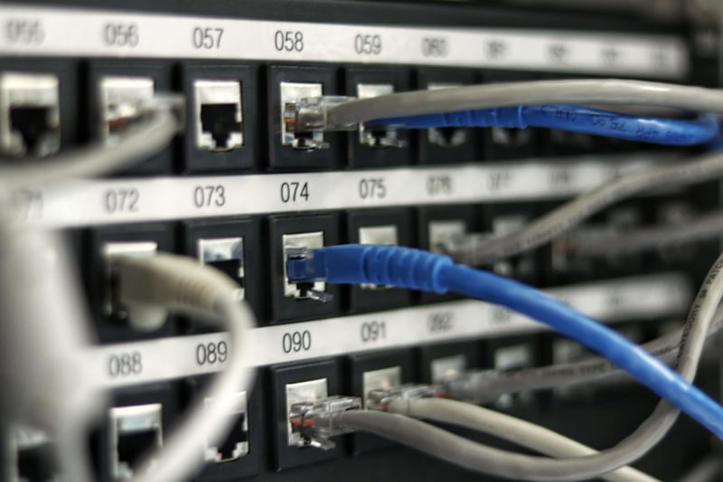
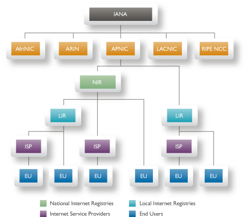

# 🔢 Understanding IP Addresses and Network Access

> *"On the Internet, nobody knows you're a dog." — But they can probably figure out your IP address!*



---

## 📚 Table of Contents
- [What is an IP Address?](#what-is-an-ip-address)
- [IPv4: The Original Standard](#ipv4-the-original-standard)
- [IPv6: The Future is Here](#ipv6-the-future-is-here)
- [Public vs Private IP Addresses](#public-vs-private-ip-addresses)
- [How IP Addresses Are Assigned](#how-ip-addresses-are-assigned)
- [NAT: Network Address Translation](#nat-network-address-translation)
- [Static vs Dynamic IP](#static-vs-dynamic-ip)
- [Finding Your IP Address](#finding-your-ip-address)
- [Subnetting Basics](#subnetting-basics)
- [IP Address Security & Privacy](#ip-address-security--privacy)

---

## 🤔 What is an IP Address?

An **IP (Internet Protocol) Address** is like your computer's mailing address on the Internet. Every device needs one to send and receive data.

```
┌─────────────────────────────────────────────────────────────────┐
│                    IP ADDRESS ANALOGY                           │
├─────────────────────────────────────────────────────────────────┤
│                                                                  │
│    📮 Physical Address              💻 IP Address               │
│                                                                  │
│    123 Main Street                  192.168.1.100               │
│    Apartment 4B                          │                       │
│    New York, NY 10001                    │                       │
│    USA                                   │                       │
│                                          ▼                       │
│    Used by postal                   Used by routers             │
│    workers to deliver               to deliver data             │
│    your mail                        packets                      │
│                                                                  │
└─────────────────────────────────────────────────────────────────┘
```

### Key Characteristics

| Property | Description |
|----------|-------------|
| **Unique** | No two devices on the same network can have the same IP |
| **Numerical** | Made up of numbers (and letters in IPv6) |
| **Hierarchical** | Structured to allow efficient routing |
| **Temporary** | Can change (dynamic) or stay the same (static) |

---

## 📟 IPv4: The Original Standard

### The Format

IPv4 addresses consist of **4 numbers** (called octets) separated by dots.

```
      192  .  168  .    1   .  100
       │       │        │       │
       │       │        │       └─── 4th Octet (0-255)
       │       │        └─────────── 3rd Octet (0-255)
       │       └──────────────────── 2nd Octet (0-255)
       └──────────────────────────── 1st Octet (0-255)
       
    Each octet = 8 bits = 1 byte
    Total = 32 bits = 4 bytes
```

### Binary Representation

Every IP address is actually a 32-bit binary number!

```
    Decimal:     192    .   168    .     1    .   100
                  │          │           │          │
    Binary:   11000000 . 10101000 . 00000001 . 01100100
              └────────────────────────────────────────┘
                          32 bits total
```

### How Many IPv4 Addresses Exist?

```
    2³² = 4,294,967,296 addresses
    
    ┌──────────────────────────────────────────────────┐
    │  That sounds like a lot, but...                  │
    │                                                  │
    │  🌍 World Population: ~8 billion                 │
    │  📱 Devices per person: 3-4 average              │
    │  🔌 IoT devices: 15+ billion                     │
    │                                                  │
    │  We ran out of IPv4 addresses in 2011! 😱        │
    └──────────────────────────────────────────────────┘
```

### IPv4 Address Classes (Historical)

```
┌─────────────────────────────────────────────────────────────────┐
│                    IPv4 ADDRESS CLASSES                         │
├─────────────────────────────────────────────────────────────────┤
│                                                                  │
│  Class │ First Octet │    Range           │ Default Mask        │
│  ──────┼─────────────┼────────────────────┼───────────────────  │
│    A   │   1-126     │ 1.0.0.0-126.x.x.x  │ 255.0.0.0 (/8)     │
│    B   │   128-191   │ 128.0.0.0-191.x.x  │ 255.255.0.0 (/16)  │
│    C   │   192-223   │ 192.0.0.0-223.x.x  │ 255.255.255.0 (/24)│
│    D   │   224-239   │ Multicast          │ N/A                 │
│    E   │   240-255   │ Experimental       │ N/A                 │
│                                                                  │
│  Note: 127.x.x.x is reserved for loopback (localhost)          │
│                                                                  │
└─────────────────────────────────────────────────────────────────┘
```

### Special IPv4 Addresses

| Address | Purpose |
|---------|---------|
| `0.0.0.0` | "Any" address / Default route |
| `127.0.0.1` | Localhost (your own computer) |
| `255.255.255.255` | Broadcast (send to everyone) |
| `169.254.x.x` | Link-local (no DHCP available) |
| `10.x.x.x` | Private network (Class A) |
| `172.16.x.x - 172.31.x.x` | Private network (Class B) |
| `192.168.x.x` | Private network (Class C) |

---

## 🚀 IPv6: The Future is Here

### Why IPv6?

```
    IPv4: 4.3 billion addresses 😰
    IPv6: 340 undecillion addresses 🤯
    
    That's: 340,282,366,920,938,463,463,374,607,431,768,211,456
    
    Or roughly: 5 × 10²⁸ addresses for every person on Earth!
```

### IPv6 Format

```
    2001:0db8:85a3:0000:0000:8a2e:0370:7334
    └──┘ └──┘ └──┘ └──┘ └──┘ └──┘ └──┘ └──┘
      │    │    │    │    │    │    │    │
      └────┴────┴────┴────┴────┴────┴────┴── 8 groups
                                              │
                                    16 bits each (hexadecimal)
                                              │
                                    Total: 128 bits
```

### IPv6 Simplification Rules

```
    Full Form:    2001:0db8:85a3:0000:0000:8a2e:0370:7334
                           │           │
                           ▼           ▼
    Remove leading zeros:
                  2001:db8:85a3:0:0:8a2e:370:7334
                              │   │
                              ▼   ▼
    Consecutive zeros to :::
                  2001:db8:85a3::8a2e:370:7334
                              ↑
                         (only once!)
```

### IPv4 vs IPv6 Comparison

| Feature | IPv4 | IPv6 |
|---------|------|------|
| **Address Length** | 32 bits | 128 bits |
| **Number of Addresses** | ~4.3 billion | ~340 undecillion |
| **Format** | Decimal (192.168.1.1) | Hexadecimal (2001:db8::1) |
| **Header Size** | 20-60 bytes | 40 bytes (fixed) |
| **Checksum** | Yes | No (handled by other layers) |
| **IPSec** | Optional | Built-in |
| **Broadcast** | Yes | No (uses multicast) |
| **Configuration** | Manual or DHCP | Auto-configuration (SLAAC) |

### IPv6 Address Types

```
┌─────────────────────────────────────────────────────────────────┐
│                    IPv6 ADDRESS TYPES                           │
├─────────────────────────────────────────────────────────────────┤
│                                                                  │
│  🌍 Global Unicast (2000::/3)                                   │
│     └─ Publicly routable, like IPv4 public addresses           │
│                                                                  │
│  🔗 Link-Local (fe80::/10)                                      │
│     └─ Communication within local network segment               │
│                                                                  │
│  🏠 Unique Local (fc00::/7)                                     │
│     └─ Similar to IPv4 private addresses                        │
│                                                                  │
│  📢 Multicast (ff00::/8)                                        │
│     └─ One-to-many communication                                │
│                                                                  │
│  🔄 Loopback (::1)                                              │
│     └─ Equivalent to IPv4's 127.0.0.1                           │
│                                                                  │
└─────────────────────────────────────────────────────────────────┘
```

### 🎬 Watch: IPv4 vs IPv6 Explained

[](https://www.youtube.com/watch?v=ThdO9beHhpA)

> 🔗 **Video**: [IPv4 vs IPv6 - What's the Difference?](https://www.youtube.com/watch?v=ThdO9beHhpA)

---

## 🏠 Public vs Private IP Addresses

### The Two Types

```
┌─────────────────────────────────────────────────────────────────┐
│                                                                  │
│                     THE INTERNET                                │
│                          │                                       │
│                          │ Public IP                            │
│                          │ (203.45.67.89)                       │
│                          ▼                                       │
│                    ┌──────────┐                                 │
│                    │  ROUTER  │ ◄── Your router has the         │
│                    │   NAT    │     public IP!                  │
│                    └────┬─────┘                                 │
│                         │                                        │
│         ┌───────────────┼───────────────┐                       │
│         │               │               │                       │
│         ▼               ▼               ▼                       │
│    ┌────────┐     ┌────────┐     ┌────────┐                    │
│    │   💻   │     │   📱   │     │   📺   │                    │
│    │192.168.│     │192.168.│     │192.168.│                    │
│    │  1.2   │     │  1.3   │     │  1.4   │                    │
│    └────────┘     └────────┘     └────────┘                    │
│    Private IP     Private IP     Private IP                    │
│                                                                  │
│    These addresses are only valid within your home!            │
│                                                                  │
└─────────────────────────────────────────────────────────────────┘
```

### Private IP Ranges

| Range | Class | # of Addresses | Common Use |
|-------|-------|----------------|------------|
| `10.0.0.0 - 10.255.255.255` | A | 16,777,216 | Large organizations |
| `172.16.0.0 - 172.31.255.255` | B | 1,048,576 | Medium networks |
| `192.168.0.0 - 192.168.255.255` | C | 65,536 | Home networks |

### Why Private IPs?

```
    Problem: Only 4.3 billion IPv4 addresses
    Solution: Reuse private IPs + NAT!
    
    ┌─────────────────────────────────────────────────────────┐
    │                                                          │
    │  🏠 House A                    🏠 House B                │
    │  192.168.1.1 (Router)         192.168.1.1 (Router)      │
    │  192.168.1.2 (Laptop)         192.168.1.2 (Laptop)      │
    │  192.168.1.3 (Phone)          192.168.1.3 (Phone)       │
    │                                                          │
    │  Same private IPs, but different public IPs!            │
    │  Public: 103.45.67.1          Public: 98.76.54.2        │
    │                                                          │
    │  Billions of devices share the same private IP ranges   │
    │  but each network has a unique public IP!               │
    │                                                          │
    └─────────────────────────────────────────────────────────┘
```

---

## 👔 How IP Addresses Are Assigned

### The Global Hierarchy



```
                    ┌─────────────────┐
                    │      IANA       │
                    │  (Global Boss)  │
                    └────────┬────────┘
                             │
         ┌───────────────────┼───────────────────┐
         │                   │                   │
         ▼                   ▼                   ▼
    ┌─────────┐        ┌─────────┐        ┌─────────┐
    │  ARIN   │        │RIPE NCC │        │  APNIC  │
    │(N.America)       │(Europe) │        │(Asia)   │
    └────┬────┘        └────┬────┘        └────┬────┘
         │                  │                  │
    ┌────┴────┐       ┌─────┴────┐       ┌─────┴────┐
    │   ISP   │       │   ISP    │       │   ISP    │
    │(Comcast)│       │(Vodafone)│       │ (Airtel) │
    └────┬────┘       └────┬─────┘       └────┬─────┘
         │                 │                  │
         ▼                 ▼                  ▼
    ┌─────────┐      ┌─────────┐       ┌─────────┐
    │   You   │      │   You   │       │   You   │
    └─────────┘      └─────────┘       └─────────┘
```

### Regional Internet Registries (RIRs)

| RIR | Region | Headquarters |
|-----|--------|--------------|
| **ARIN** | North America | Chantilly, Virginia, USA |
| **RIPE NCC** | Europe, Middle East, Central Asia | Amsterdam, Netherlands |
| **APNIC** | Asia-Pacific | Brisbane, Australia |
| **LACNIC** | Latin America, Caribbean | Montevideo, Uruguay |
| **AFRINIC** | Africa | Ebene, Mauritius |

---

## 🔄 NAT: Network Address Translation

NAT is the magic that lets millions of devices share one public IP!

### How NAT Works

```
┌─────────────────────────────────────────────────────────────────┐
│                       NAT IN ACTION                              │
├─────────────────────────────────────────────────────────────────┤
│                                                                  │
│  STEP 1: Your laptop wants to visit google.com                  │
│                                                                  │
│  💻 Laptop (192.168.1.5:54321) ──► 🌐 Router                   │
│      "Send to Google (142.250.195.46:443)"                      │
│                                                                  │
│  STEP 2: Router performs NAT                                    │
│                                                                  │
│  ┌──────────────────────────────────────────────────────┐       │
│  │              NAT TABLE                                │       │
│  │  ┌────────────────────┬──────────────────────────┐   │       │
│  │  │ Internal           │ External                  │   │       │
│  │  ├────────────────────┼──────────────────────────┤   │       │
│  │  │ 192.168.1.5:54321  │ 203.45.67.89:12001      │   │       │
│  │  │ 192.168.1.3:45678  │ 203.45.67.89:12002      │   │       │
│  │  │ 192.168.1.4:33333  │ 203.45.67.89:12003      │   │       │
│  │  └────────────────────┴──────────────────────────┘   │       │
│  └──────────────────────────────────────────────────────┘       │
│                                                                  │
│  STEP 3: Router sends request with its public IP                │
│                                                                  │
│  🌐 Router (203.45.67.89:12001) ──► 🖥️ Google                  │
│                                                                  │
│  STEP 4: Google responds to router's public IP                  │
│                                                                  │
│  🖥️ Google ──► 🌐 Router (203.45.67.89:12001)                  │
│                                                                  │
│  STEP 5: Router checks NAT table, forwards to laptop            │
│                                                                  │
│  🌐 Router ──► 💻 Laptop (192.168.1.5:54321)                   │
│                                                                  │
└─────────────────────────────────────────────────────────────────┘
```

### Types of NAT

| Type | Description | Use Case |
|------|-------------|----------|
| **Static NAT** | 1:1 mapping (private ↔ public) | Servers needing fixed public IP |
| **Dynamic NAT** | Pool of public IPs shared | Medium organizations |
| **PAT (Port Address Translation)** | Many:1 using ports | Home networks (most common!) |

### 🎬 Watch: NAT Explained

[](https://www.youtube.com/watch?v=FTUV0t6JaDA)

> 🔗 **Video**: [Network Address Translation (NAT) Explained](https://www.youtube.com/watch?v=FTUV0t6JaDA)

---

## ⚡ Static vs Dynamic IP

### Comparison

```
┌─────────────────────────────────────────────────────────────────┐
│                                                                  │
│       STATIC IP                        DYNAMIC IP               │
│       ─────────                        ──────────               │
│                                                                  │
│    ┌──────────┐                     ┌──────────┐               │
│    │ 203.45.  │                     │ Changes  │               │
│    │  67.89   │ ← Never changes     │ each     │               │
│    └──────────┘                     │ session  │               │
│                                     └──────────┘               │
│                                                                  │
│    ✅ Consistent                    ✅ Privacy (harder to track)│
│    ✅ Good for servers              ✅ Cheaper                  │
│    ✅ Remote access                 ✅ No configuration needed  │
│    ❌ More expensive                ❌ Can't host servers easily│
│    ❌ Easier to track               ❌ May break some services  │
│                                                                  │
│    Who uses it?                     Who uses it?                │
│    • Web servers                    • Home users                │
│    • Email servers                  • Mobile devices            │
│    • Businesses                     • Most internet users       │
│                                                                  │
└─────────────────────────────────────────────────────────────────┘
```

### DHCP: The IP Assigner

```
┌─────────────────────────────────────────────────────────────────┐
│                    DHCP PROCESS                                  │
├─────────────────────────────────────────────────────────────────┤
│                                                                  │
│  💻 New Device                         🌐 DHCP Server (Router)  │
│       │                                        │                 │
│       │ 1. DISCOVER                           │                 │
│       │   "Is there a DHCP server?"           │                 │
│       │──────────────────────────────────────►│                 │
│       │                                        │                 │
│       │ 2. OFFER                              │                 │
│       │   "Here's an IP you can use"          │                 │
│       │◄──────────────────────────────────────│                 │
│       │   IP: 192.168.1.25                    │                 │
│       │   Mask: 255.255.255.0                 │                 │
│       │   Gateway: 192.168.1.1                │                 │
│       │   DNS: 8.8.8.8                        │                 │
│       │                                        │                 │
│       │ 3. REQUEST                            │                 │
│       │   "I'll take that IP!"                │                 │
│       │──────────────────────────────────────►│                 │
│       │                                        │                 │
│       │ 4. ACKNOWLEDGE                        │                 │
│       │   "It's yours for 24 hours"           │                 │
│       │◄──────────────────────────────────────│                 │
│       │                                        │                 │
│       ▼                                        │                 │
│   Connected!                                   │                 │
│                                                                  │
└─────────────────────────────────────────────────────────────────┘
```

---

## 🔍 Finding Your IP Address

### Your Public IP

```bash
# Method 1: Google it!
# Search "what is my ip" on Google

# Method 2: Command line
curl ifconfig.me
# Or
curl ipinfo.io/ip
```

> 🔗 **Quick Link**: [whatismyipaddress.com](https://www.whatismyipaddress.com/)

### Your Private IP

**Windows:**
```cmd
ipconfig
# Look for "IPv4 Address"
```

**Mac:**
```bash
ifconfig | grep "inet "
# Or
ipconfig getifaddr en0
```

**Linux:**
```bash
ip addr
# Or
hostname -I
```

### Visual Guide

```
┌─────────────────────────────────────────────────────────────────┐
│                FINDING YOUR IP ADDRESSES                         │
├─────────────────────────────────────────────────────────────────┤
│                                                                  │
│   🌐 PUBLIC IP                        🏠 PRIVATE IP             │
│   (Seen by websites)                  (Local network only)      │
│                                                                  │
│   Search: "what is my ip"             Windows: ipconfig         │
│                                                                  │
│   Or visit:                           Mac: System Preferences   │
│   • whatismyipaddress.com                  → Network            │
│   • ipinfo.io                                                   │
│   • ifconfig.me                       Linux: ip addr            │
│                                                                  │
│   Example: 203.45.67.89               Example: 192.168.1.5      │
│                                                                  │
└─────────────────────────────────────────────────────────────────┘
```

---

## 🧮 Subnetting Basics

Subnetting divides a network into smaller, manageable pieces.

### Subnet Mask Explained

```
    IP Address:    192.168.1.100
    Subnet Mask:   255.255.255.0
    
    ┌────────────────────────────────────────────────────┐
    │                                                     │
    │  IP:    192.168.1.100                              │
    │  Mask:  255.255.255.0                              │
    │         ───────────┬─                              │
    │                    │                               │
    │  Network Part: 192.168.1   (Where 255 appears)    │
    │  Host Part:    .100        (Where 0 appears)      │
    │                                                     │
    │  This means:                                       │
    │  • All devices in network 192.168.1.x can talk    │
    │  • .100 is this specific device                   │
    │  • Up to 254 devices (1-254) possible             │
    │                                                     │
    └────────────────────────────────────────────────────┘
```

### CIDR Notation

```
    192.168.1.0/24
                ↑
                └── Number of bits for network portion
    
    /24 means first 24 bits are network = 255.255.255.0
    
    Common CIDR notations:
    ┌────────┬───────────────────┬──────────────┐
    │ CIDR   │ Subnet Mask       │ Hosts        │
    ├────────┼───────────────────┼──────────────┤
    │ /8     │ 255.0.0.0         │ 16,777,214   │
    │ /16    │ 255.255.0.0       │ 65,534       │
    │ /24    │ 255.255.255.0     │ 254          │
    │ /25    │ 255.255.255.128   │ 126          │
    │ /26    │ 255.255.255.192   │ 62           │
    │ /27    │ 255.255.255.224   │ 30           │
    │ /28    │ 255.255.255.240   │ 14           │
    │ /30    │ 255.255.255.252   │ 2            │
    │ /32    │ 255.255.255.255   │ 1            │
    └────────┴───────────────────┴──────────────┘
```

### Subnetting Example

```
    Company has: 192.168.1.0/24 (254 hosts)
    Needs: 4 departments with separate networks
    
    Solution: Create 4 subnets with /26
    
    ┌─────────────────────────────────────────────────────┐
    │  Subnet 1: 192.168.1.0/26                          │
    │            Range: 192.168.1.1 - 192.168.1.62       │
    │            (Sales Department)                       │
    │                                                     │
    │  Subnet 2: 192.168.1.64/26                         │
    │            Range: 192.168.1.65 - 192.168.1.126     │
    │            (Engineering)                            │
    │                                                     │
    │  Subnet 3: 192.168.1.128/26                        │
    │            Range: 192.168.1.129 - 192.168.1.190    │
    │            (Marketing)                              │
    │                                                     │
    │  Subnet 4: 192.168.1.192/26                        │
    │            Range: 192.168.1.193 - 192.168.1.254    │
    │            (HR)                                     │
    └─────────────────────────────────────────────────────┘
```

---

## 🔒 IP Address Security & Privacy

### What Your IP Reveals

```
┌─────────────────────────────────────────────────────────────────┐
│            WHAT WEBSITES CAN LEARN FROM YOUR IP                 │
├─────────────────────────────────────────────────────────────────┤
│                                                                  │
│   ✅ Can determine:                                             │
│   • General location (city/region)                              │
│   • Internet Service Provider                                   │
│   • Organization (if business IP)                               │
│   • Connection type (mobile, broadband, etc.)                   │
│                                                                  │
│   ❌ Cannot determine:                                          │
│   • Exact street address                                        │
│   • Your name or identity                                       │
│   • What you're doing online (if encrypted)                     │
│   • Device information from IP alone                            │
│                                                                  │
│   ⚠️ With legal process, ISPs can link IP to subscriber        │
│                                                                  │
└─────────────────────────────────────────────────────────────────┘
```

### Protecting Your IP Address

```
    1. VPN (Virtual Private Network)
       ┌──────────────────────────────────────────────┐
       │  Your Device → VPN Server → Website          │
       │                    ↑                         │
       │         Website sees VPN's IP,               │
       │         not yours!                           │
       └──────────────────────────────────────────────┘
    
    2. Tor Network
       ┌──────────────────────────────────────────────┐
       │  You → Node 1 → Node 2 → Node 3 → Website   │
       │                                              │
       │  Multiple layers of encryption               │
       │  Very anonymous, but slower                  │
       └──────────────────────────────────────────────┘
    
    3. Proxy Server
       ┌──────────────────────────────────────────────┐
       │  Your Device → Proxy → Website              │
       │                  ↑                          │
       │      Less secure than VPN,                  │
       │      but can hide IP                        │
       └──────────────────────────────────────────────┘
```

---

## 🧪 Hands-On Exercises

### Exercise 1: Find Both Your IPs

1. Find your public IP: Visit [whatismyipaddress.com](https://www.whatismyipaddress.com/)
2. Find your private IP: Run `ipconfig` (Windows) or `ip addr` (Linux/Mac)
3. Compare them - are they different?

### Exercise 2: Trace an IP

```bash
# Look up information about an IP
curl ipinfo.io/8.8.8.8

# You'll see:
# - City
# - Region  
# - Country
# - Organization (Google in this case)
```

### Exercise 3: Binary Conversion

Convert these IP addresses to binary:
1. `10.0.0.1`
2. `192.168.1.1`
3. `8.8.8.8`

<details>
<summary>Click for answers</summary>

1. `10.0.0.1` = `00001010.00000000.00000000.00000001`
2. `192.168.1.1` = `11000000.10101000.00000001.00000001`
3. `8.8.8.8` = `00001000.00001000.00001000.00001000`

</details>

---

## 📖 Key Takeaways

```
┌──────────────────────────────────────────────────────────────┐
│                    KEY TAKEAWAYS                              │
├──────────────────────────────────────────────────────────────┤
│                                                               │
│  ✅ IP addresses are unique identifiers for devices          │
│                                                               │
│  ✅ IPv4 (32-bit) is running out; IPv6 (128-bit) is future  │
│                                                               │
│  ✅ Private IPs are for local networks; public IPs face     │
│     the internet                                              │
│                                                               │
│  ✅ NAT allows multiple devices to share one public IP      │
│                                                               │
│  ✅ DHCP automatically assigns IP addresses                 │
│                                                               │
│  ✅ IANA → RIRs → ISPs → You (hierarchy of assignment)      │
│                                                               │
│  ✅ Your IP reveals general location but not your identity  │
│                                                               │
│  ✅ VPNs and proxies can help protect your IP privacy       │
│                                                               │
└──────────────────────────────────────────────────────────────┘
```

---

## 🔗 Additional Resources

### 📹 Videos
- [IP Addresses Explained - PowerCert](https://www.youtube.com/watch?v=7_-qWlvQQtY)
- [IPv4 vs IPv6 - NetworkChuck](https://www.youtube.com/watch?v=ThdO9beHhpA)
- [Subnetting Mastery - Practical Networking](https://www.youtube.com/watch?v=BWZ-MHIhqjk)

### 🛠️ Tools
- [IP Calculator](https://jodies.de/ipcalc)
- [IPv6 Test](https://test-ipv6.com/)
- [IP Lookup](https://ipinfo.io/)

### 📚 Further Reading
- [RFC 791 - Internet Protocol](https://tools.ietf.org/html/rfc791)
- [RFC 8200 - IPv6 Specification](https://tools.ietf.org/html/rfc8200)

---

## ⏭️ What's Next?

Now that you understand IP addresses, let's explore:

**[➡️ 03 - DNS: The Internet's Phone Book](../03-dns-domain-name-system.md)**

We'll learn:
- How domain names become IP addresses
- DNS hierarchy and resolution
- DNS records (A, AAAA, CNAME, MX, etc.)
- DNS security

---

<div align="center">

**🎓 Elite Ball Knowledge - Internet Fundamentals**

[← Previous: How Internet Works](./01-how-internet-works.md) | [Home](./README.md) | [Next: DNS →](./03-dns-domain-name-system.md)

</div>


